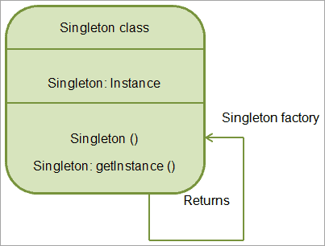
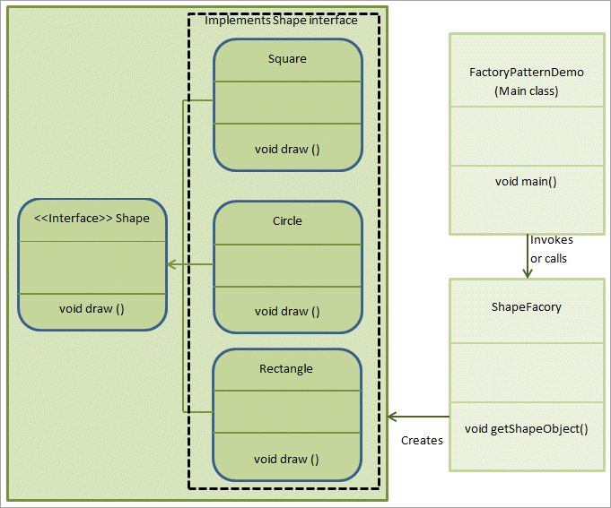
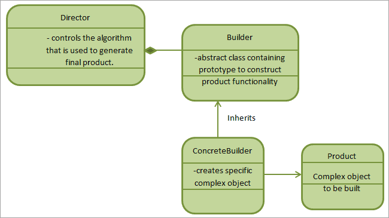

# Design Patterns: Singleton, Factory, Builder, Prototype, Abstract

When we solve a specific problem, we can solve it more efficiently if we have some best practices already defined. This indeed will help us follow to follow the best practices and develop more reliable and efficient solutions. 

These **best practices** that can be used to develop **well-proved solutions** for solving problems are called **"Design Patterns"**. Experienced OOP software developers use design patterns to solve specific tasks. 

## Design Patterns in Python
Design patterns were first invented by Christopher Alexander in 1977. But later on four developers namely Erich Gamma, Richard Helm, Ralph Johnson, and John Vlissides wrote a book titled "Design Patterns: Elements of Reusable Object-Oriented Software" in 1994. This book is also known as the "Gang of Four" (GoF) book.

From then all the design patterns came to be known as "Gang of Four Design Patterns". 

Design patterns are independent of any programming languages as they are used to solve common object-oriented design problems and are not just limited to a specific programming language. So basically it’s an idea and not an implementation.

Thus using design patterns we can develop programs that are more efficient, flexible, maintainable, and reusable.

### Advantages of Design Patterns

Enlisted below are some of the advantages of using design patterns in our applications:
- Design patterns are reusable and can be used by multiple projects.
- We can define system architecture using design patterns.
- Design patterns provide transparency to the application design.
- Design patterns are already well-tested and proved so that we can use them without any worries.
- Design patterns allow us to build better systems and also provide clarity to the system architecture.

### When To Use Design Patterns
So when should we use design patterns? 

We usually use a design pattern during the initial Analysis and requirement phase of SDLC (Software Development Life Cycle). When used during the analysis and requirement phase of SDLC, it provides more information to this phase. Python internally supports design patterns.

**Design patterns in Python are categorized as follows:**

                    Design Patterns
                    |
                    |__ Creational Patterns
                    |   |__ Singleton
                    |   |__ Factory
                    |   |__ Abstract Factory
                    |   |__ Builder
                    |   |__ Prototype
                    |__ Structural Patterns
                    |__ Behavioral Patterns

We are interested only in creational design patterns.

**Creational design patterns are further classified as follows:**

                    Creational Design Patterns
                    |
                    |__ Singleton Design Patterns
                    |__ Factory Design Patterns
                    |__ Abstract Factory Design Patterns
                    |__ Builder Design Patterns
                    |__ Prototype Design Patterns

In this repo, we will discuss the following design patterns:


#### 1. Singleton Pattern In Python
The Singleton pattern is a creational design pattern in Python. It's a way to ensure that a class has only one instance, and provides a global access point to it. In other words, the Singleton pattern restricts the instantiation of a class to one object.

The Singleton pattern is often used in scenarios where you need a global point of access to an instance of a class, such as logging, configuration management, or caching. By ensuring there is only one instance, it helps maintain state and avoid issues that can arise from multiple instances.

**Advantages**
- As only one instance of the singleton class is used, we save memory.
- Also, ensures reusability as the same singleton object is used again and again.

Here's a simple example of implementing the Singleton pattern in Python:

**Implementation Of The Singleton Pattern**
As already mentioned, a singleton design pattern restricts the class with only one instance and this instance is given a global point of access. These were all classes that refer to the same object again and again.

The following UML diagram explains the Singleton pattern.



As the above UML diagram shows, a singleton class has a single instance defined and we access it by the getInstance () method. So a singleton factory that is responsible for creating objects makes use of the getInstance method to return the same object (which is there in the class) again and again.

Let's implement the Singleton pattern in Python program to create a Singleton object:

```python
class SingletonObject:
    # Class-level variable to store the single instance
    _instance = None

    # Private constructor
    def __new__(cls):
        if cls._instance is None:
            cls._instance = super(SingletonObject, cls).__new__(cls)
        return cls._instance

    # Method to print a message
    def print_message(self):
        print("Hello from Singleton object!!!")

# Main function to demonstrate the Singleton pattern
if __name__ == "__main__":
    # Get the single instance of SingletonObject
    object1 = SingletonObject()
    object2 = SingletonObject()

    # Show the message
    object1.print_message()

    # Demonstrate that both references point to the same instance
    print(f"object1 is object2: {object1 is object2}")
```

**Explanation**

- `__new__` is overridden to ensure that only one instance of `SingletonObject` is created.
- The check `if cls._instance is None` ensures that a new instance is created only once.
- Running this code will print the message from the `print_message()` method and confirm that `object1` and `object2` are the same instance by printing `True` for `object1 is object2`.


#### 2. Factory Pattern In Python
In Python, we can use the Factory Pattern similarly by defining an interface (or base class) and implementing multiple concrete classes based on that interface. A separate Factory class is then used to create instances of these concrete classes based on provided input.

**Advantages of the Factory Pattern**

- **Encapsulation of Object Creation**: The Factory Pattern keeps the object creation logic hidden from the user, so the user only interacts with the Factory to get instances. ie: the actual creation logic is not exposed to the outside world.
- **Flexible Instantiation**: The Factory Pattern allows easy replacement or extension of the instantiation logic if new classes need to be added.

So if a class implementing a factory pattern has a method to calculate the rate of interest, then the concrete classes that implement the factory pattern will have their own implementation of the method to calculate the rate of interest.

Then there will be another class that is a factory class that will access these concrete class instances so that we are not aware of how the logic to calculate the rate of interest is implemented. We only call the method and get the output.

**When to Use the Factory Pattern**

- When the parent classes want to delegate the responsibility of object creation to subclasses or a specific Factory class.
- When the parent class doesn’t know which subclass needs to be instantiated (created) and needs flexibility.

**Implementation of the Factory Pattern in Python**
As an example let’s implement a generic shape interface. We can derive various concrete classes from this interface like the circle, rectangle, etc. Then we will have a shapeFactory class that will access the concrete class objects. The UML for this pattern is shown below.



**Let’s implement a Factory Pattern to create various geometric shapes (like Circle, Rectangle, and Square) based on a shape type.**

```python
from abc import ABC, abstractmethod

# GeometricShape Interface (abstract base class)
class GeometricShape(ABC):
    @abstractmethod
    def draw_shape(self):
        pass

# Concrete classes implementing the GeometricShape interface
class Rectangle(GeometricShape):
    def draw_shape(self):
        print("Rectangle class::draw_shape() method.")

class Square(GeometricShape):
    def draw_shape(self):
        print("Square class::draw_shape() method.")

class Circle(GeometricShape):
    def draw_shape(self):
        print("Circle class::draw_shape() method.")

# Factory class for GeometricShape
class ShapeFactory:
    def shape_object(self, shape_type):
        # Return an object of the specified shape type
        if shape_type is None:
            return None
        elif shape_type.lower() == "circle":
            return Circle()
        elif shape_type.lower() == "rectangle":
            return Rectangle()
        elif shape_type.lower() == "square":
            return Square()
        return None

# Main code to demonstrate the Factory Pattern
if __name__ == "__main__":
    # Create a ShapeFactory object
    shape_factory = ShapeFactory()

    # Create Circle object and call draw_shape method
    shape_circle = shape_factory.shape_object("CIRCLE")
    shape_circle.draw_shape()

    # Create Rectangle object and call draw_shape method
    shape_rectangle = shape_factory.shape_object("RECTANGLE")
    shape_rectangle.draw_shape()

    # Create Square object and call draw_shape method
    shape_square = shape_factory.shape_object("SQUARE")
    shape_square.draw_shape()
```

**Explanation**

1. **Define an Interface (or Abstract Base Class) for Shapes**:
   - `GeometricShape` is an abstract base class with an abstract method `draw_shape()` which each shape class must implement.

2. **Implement Concrete Shape Classes**:
   - `Rectangle`, `Square`, and `Circle` classes inherit from `GeometricShape` and implement the `draw_shape()` method.

3. **Create a Factory Class (`ShapeFactory`)**:
   - The `ShapeFactory` class has a method `shape_object()` which takes a shape type as input and returns an instance of the corresponding concrete shape class.
   - This method hides the instantiation details and provides flexibility for creating different shapes.

4. **Main Program**:
   - We instantiate `ShapeFactory` and use it to create different shape objects (`Circle`, `Rectangle`, `Square`) by passing the shape type to `shape_object()`.
   - The shapes can then be used to call their respective `draw_shape()` method.

**Output**

Running the code will produce the following output:

```plaintext
Rectangle class::draw_shape() method.
Square class::draw_shape() method.
Circle class::draw_shape() method.
```

This output confirms that each shape’s `draw_shape()` method is called correctly, and the Factory Pattern is used to abstract the instantiation logic.

#### 3.  Builder Pattern in Python

In Python, the Builder Pattern helps create complex objects step-by-step. It involves a `Builder` (for constructing objects), a `Director` (for controlling the build sequence), and `Product` (the object to be built).

**Advantages of the Builder Pattern**

- Using the Builder pattern, we can separate the construction and representation of an object.
- We also can change the internal representation of the object.
- We can build complex designs like an entire delivery system using the builder pattern.

A practical example of a Builder pattern is the food ordering system which involved complex steps of collecting food items that are ordered, then packaging, billing, building order, and then shipping it.

Here, we will implement an example of a tablet ordering system using the Builder pattern.

**Implementation Of Builder Pattern**
The general UML diagram for the Builder pattern is given below.



The above diagram shows the Builder pattern UML diagram. As shown in the above diagram, we have four components in the Builder pattern.

1. **Product**: Represents the complex object being built (e.g., `TabType`).
2. **Builder Abstract Class**: Defines the interface with all methods to build parts of the object. (an abstract class containing prototypes of all the functionality required to build a complex object.)
3. **ConcreteBuilder**: Implements the interface, building specific instances of the object. (concrete class that inherits from the Builder class and creates a particular complex object. We can have as many ConcreteBuilder classes as we need.)
4. **Director**: Manages the construction process and builds the final object. (controls the algorithms that generate the final product.)


**Let’s implement a tablet ordering system using the Builder Pattern in Python.**

```python
from abc import ABC, abstractmethod

# Packing Interface for tablets
class Packing(ABC):
    @abstractmethod
    def pack(self):
        pass

    @abstractmethod
    def price(self):
        pass

# Tablet abstract class implementing Packing
class Tablet(Packing):
    @abstractmethod
    def pack(self):
        pass

# Company abstract class extending Tablet
class Company(Tablet):
    @abstractmethod
    def price(self):
        pass

# Concrete Lenovo class
class Lenovo(Company):
    def price(self):
        return 541

    def pack(self):
        return "Lenovo Yoga"

# Concrete MicroMax class
class MicroMax(Company):
    def price(self):
        return 338

    def pack(self):
        return "MicroMax"

# TabType class to represent a complex tablet order
class TabType:
    def __init__(self):
        self.items = []

    # Add items to the order
    def add_item(self, item):
        self.items.append(item)

    # Retrieve total cost
    def get_cost(self):
        return sum(item.price() for item in self.items)

    # Show all items in the order
    def show_items(self):
        for item in self.items:
            print(f"Tablet name: {item.pack()}, Price (USD): {item.price()}")

# Builder class for tablet orders
class TabBuilder:
    # Build Lenovo tab
    def build_lenovo_tab(self):
        lenovo_order = TabType()
        lenovo_order.add_item(Lenovo())
        return lenovo_order

    # Build MicroMax tab
    def build_micromax_tab(self):
        micromax_order = TabType()
        micromax_order.add_item(MicroMax())
        return micromax_order

# Main code to demonstrate the Builder Pattern
if __name__ == "__main__":
    # Create a TabBuilder object
    tab_builder = TabBuilder()

    # Build Lenovo order and show details
    lenovo_tab = tab_builder.build_lenovo_tab()
    print("Lenovo Tablet Order:")
    lenovo_tab.show_items()

    # Build MicroMax order and show details
    micromax_tab = tab_builder.build_micromax_tab()
    print("\nMicroMax Tablet Order:")
    micromax_tab.show_items()
```

**Explanation**

1. **Packing Interface**:
   - The `Packing` abstract class represents items with a `pack()` and `price()` method.

2. **Concrete Tablet Classes**:
   - `Lenovo` and `MicroMax` inherit from `Company` and provide specific implementations for `pack()` and `price()`, representing the distinct details for each tablet.

3. **Product Class (`TabType`)**:
   - `TabType` is the product that represents a tablet order. It has methods to `add_item()` to the order, calculate the total cost with `get_cost()`, and display order details with `show_items()`.

4. **Builder Class (`TabBuilder`)**:
   - `TabBuilder` is responsible for creating instances of `TabType` with Lenovo or MicroMax tablets. It acts as the builder that configures the `TabType` order with the required items.

5. **Client Code**:
   - We instantiate `TabBuilder`, create a Lenovo and MicroMax order, and use `show_items()` to display each tablet’s details.

**Output**

Running this code will output:

```plaintext
Lenovo Tablet Order:
Tablet name: Lenovo Yoga, Price (USD): 600

MicroMax Tablet Order:
Tablet name: MicroMax, Price (USD): 400
```

This confirms the Builder Pattern successfully constructed two different tablet orders with distinct properties.